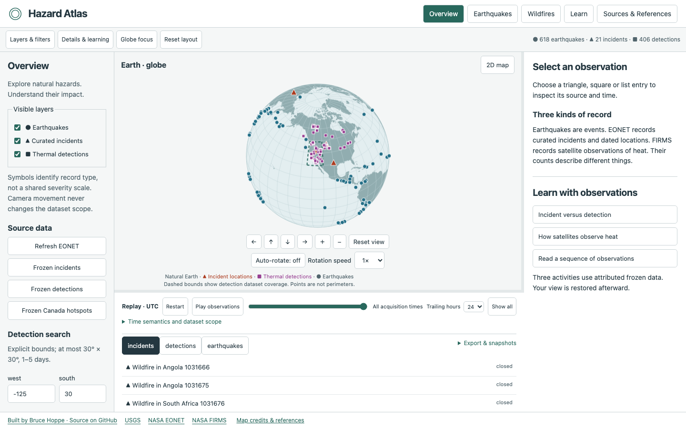

# Hazard Atlas

Explore natural hazards. Understand their impact. Hazard Atlas is a local Go application that combines the complete earthquake observatory with curated NASA EONET wildfire incidents and a distinct NASA FIRMS NOAA-20 VIIRS thermal-detection layer. It is an evidence viewer, not an emergency notification service, evacuation planner, prediction engine, or impact estimator. It runs without LLM calls, accounts, telemetry, Node, or Go on the recipient's computer.



## Run a packaged release

Download/extract the appropriate archive in `release/`:

- macOS Apple silicon: `darwin-arm64`; open **Hazard Atlas.app**.
- macOS Intel: `darwin-amd64`; open **Hazard Atlas.app**.
- Windows 11 x64: `windows-amd64`; run **hazard-atlas.exe**. Keep its console open while using the app; Ctrl+C stops it.

The app opens `http://127.0.0.1:8789`. Only the local computer can access the server. The earthquake demo and frozen wildfire observations are embedded. Live EONET data needs internet access; live FIRMS retrieval additionally needs a server-side `HAZARD_ATLAS_FIRMS_MAP_KEY`. These local release candidates are not Developer ID notarized or Authenticode signed. See [release readiness](docs/release-readiness.md).

## Development

Prerequisites: Go 1.26+ (tested with 1.27.1), Node 22.12+ (tested with 26.8.1), npm. Python 3 is used only to create ZIP archives. Pinned dependencies are in go.mod/go.sum and package-lock.json.

macOS/Linux:

```sh
npm ci
npm run build
go run ./cmd/observatory
```

Windows PowerShell:

```powershell
npm ci
npm run build
go run ./cmd/observatory
# Build a standalone executable:
go build -trimpath -o hazard-atlas.exe ./cmd/observatory
.\hazard-atlas.exe
```

These PowerShell instructions are supplied but have not been exercised on Windows in this macOS session.

```sh
# Offline start, custom port and isolated cache
go run ./cmd/observatory -demo -addr 127.0.0.1:8789 -data-dir ./local-data
# Automated checks
npm test
npm run check
npm run format:check
go test -race ./...
go vet ./...
# Browser QA: run a demo instance at :8789 first
npx playwright install chromium
node scripts/browser-check.mjs
node scripts/hazard-browser-check.mjs
# Build all three release archives (macOS host)
./scripts/release.sh
```

## Explore

Overview fills the browser with a resizable workspace: layers and filters on the left, a globe in the centre, details and learning on the right, and a timeline/list below. Use **Globe focus** or **Reset layout** as needed. Resizing the panels resizes the Canvas renderer and its picking coordinates. On narrow screens use Globe, List, and Learn tabs.

The overview keeps earthquake events, EONET incident records, and FIRMS thermal detections as separate layers and separate counts. Triangles identify curated wildfire incidents, squares identify satellite detections, and circles identify earthquakes. Marker size and colour are not a cross-hazard severity scale.

The **Wildfires** module starts with frozen, attributed data so it is useful without credentials. **Refresh EONET** retrieves current curated wildfire records. **Frozen Canada hotspots** adds Natural Resources Canada CWFIS Fire M3 satellite observations; the live CWFIS daily feed is also available without a key. FIRMS queries require explicit bounds no larger than 30° by 30° and one to five UTC days; a date-line query is split into two bounded requests. Configure the key only on the server:

```sh
HAZARD_ATLAS_FIRMS_MAP_KEY=your-map-key go run ./cmd/observatory
```

EONET open/closed is retained as a provider status, not burning or containment. FIRMS detections are thermal observations, not ignition points, fire perimeters, burned area, or incident membership. Nearby detections are labelled spatial/temporal proximity only.

Sources & References also records CWFIS GeoServer services, NASA FIRMS US/Canada, Copernicus EFFIS and the Copernicus Early Warning Data Store. These sources have different geographic coverage, update schedules, access requirements and scientific meanings; the application keeps their records separate.

Select a **Current area of activity** to centre Earth and apply visible bounds. Cells are 20° latitude/longitude and sorted by recorded event count; they are not hazard scores. Clear the region to return to global results. Region presets include Japan, Alaska, California, Indonesia, Tonga, the Andes and New Zealand. Custom bounds can cross the date line.

Drag to rotate, pinch to zoom, or focus the canvas before using the wheel. Buttons provide keyboard equivalents. Select markers directly; overlapping markers open a chooser. Event selection pauses both camera rotation and replay. Resume each explicitly. The 2D map, table, charts and exports share the same filters and replay cursor.

**Learn** offers four existing earthquake activities and three wildfire activities: incident versus detection, how satellites observe heat, and reading a sequence of observations. Activities use attributed frozen records, provide reset/return controls, and keep explanations local and reviewed against the source documentation.

**Save complete snapshot** creates a hashed JSON file containing the current earthquake, incident, detection, coverage, filters, and view state. Reopen it offline without contacting a provider. Incident and detection CSV/GeoJSON exports retain record types, units, source IDs, query coverage, freshness, and filter metadata. A shared link reapplies a query on a running observatory; it is not a publicly hosted URL or an immutable catalog snapshot.

## Troubleshooting

- Port already in use: open the existing URL or launch with `-addr 127.0.0.1:8790`.
- USGS unavailable: an existing recent cache is returned with a stale label. Choose **Offline historical demo** if no cached data exists.
- No events: clear filters and nearby selection, show all replay times, or use a longer period.
- Blank geography: events remain accessible in the table. Bundled files mean no map-provider account is required.
- Close/stop: choose **Stop the local server** at the foot of the page, or press Ctrl+C in its terminal.

Read [QUICKSTART](QUICKSTART.md), [baseline](docs/baseline.md), [migration plan](docs/migration-plan.md), [data model](docs/data-model.md), [operations](docs/operations.md), [scientific methods](docs/scientific-methods.md), [API](docs/api.md), [sources](docs/sources.md), and [release evidence](docs/release-readiness.md).

Licensed under the [MIT License](LICENSE). Third-party licenses are recorded in [THIRD_PARTY_NOTICES.md](THIRD_PARTY_NOTICES.md). This is an educational observatory, not an earthquake prediction or emergency warning service.


Built by Bruce Hoppe · [github.com/bruce-hoppe_uoft/hazard-atlas](https://github.com/bruce-hoppe_uoft/hazard-atlas)
# hazard-atlas
